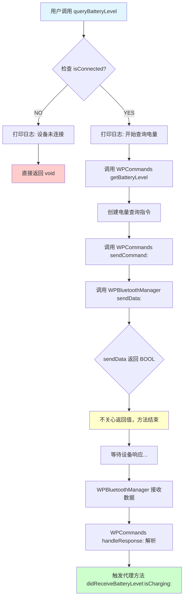
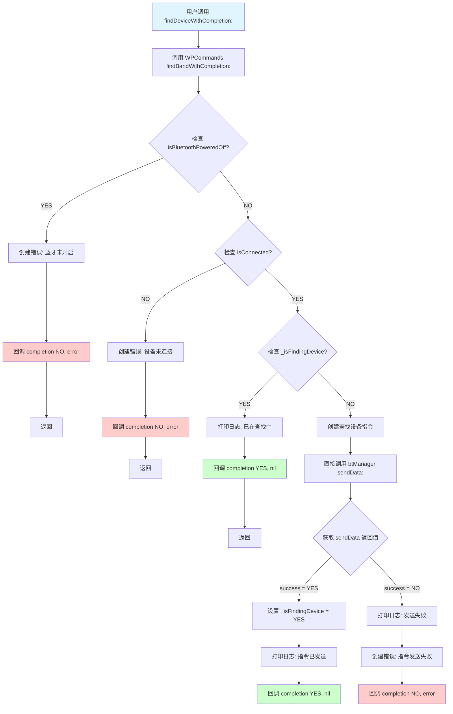

# 查找设备 vs 电量查询 - 流程对比图

## 🔄 电量查询流程



### 关键特征
- ❌ **无完成回调**
- ❌ **不检查蓝牙状态**
- ❌ **不获取 sendData 返回值**
- ✅ **结果通过代理异步返回**

---

## 🔍 查找设备流程



### 关键特征
- ✅ **有完成回调**
- ✅ **检查蓝牙状态**
- ✅ **检查连接状态**
- ✅ **检查重复请求**
- ✅ **获取 sendData 返回值**
- ✅ **立即反馈发送结果**
- ✅ **状态管理 (_isFindingDevice)**

---

## 📊 对比表格

| 流程节点 | 电量查询 | 查找设备 |
|----------|----------|----------|
| **1. 检查蓝牙状态** | ❌ 不检查 | ✅ 检查 `isBluetoothPoweredOff` |
| **2. 检查连接状态** | ✅ 检查 `isConnected` | ✅ 检查 `isConnected` |
| **3. 检查重复请求** | ❌ 不检查 | ✅ 检查 `_isFindingDevice` |
| **4. 构建指令** | ✅ 通过 `WPCommands` | ✅ 直接构建 |
| **5. 发送指令** | `WPCommands sendCommand:` | 直接 `btManager sendData:` |
| **6. 获取返回值** | ❌ 不获取 | ✅ 获取 `BOOL success` |
| **7. 状态更新** | ❌ 无状态 | ✅ 更新 `_isFindingDevice` |
| **8. 立即回调** | ❌ 无 | ✅ `completion(success, error)` |
| **9. 异步结果** | ✅ 代理方法 | ❌ 无（只有发送结果） |

---

## 🎯 核心差异总结

### 电量查询 - "发后不理"模式
```objc
queryBatteryLevel
  ├─ 检查连接 ✅
  ├─ 发送指令 ✅
  ├─ 获取结果 ❌ (不关心是否发送成功)
  └─ 等待代理回调 ✅ (异步)
```

### 查找设备 - "即时反馈"模式
```objc
findDeviceWithCompletion
  ├─ 检查蓝牙 ✅
  ├─ 检查连接 ✅
  ├─ 检查状态 ✅
  ├─ 发送指令 ✅
  ├─ 获取结果 ✅ (立即知道是否发送成功)
  ├─ 更新状态 ✅
  └─ 立即回调 ✅ (同步)
```

---

## 💡 统一建议

### 推荐：采用"查找设备"的完善模式

所有蓝牙指令发送都应该包含：

1. ✅ **完善的状态检查**
   ```objc
   if (isBluetoothPoweredOff) { /* 返回错误 */ }
   if (!isConnected) { /* 返回错误 */ }
   if (isOperationInProgress) { /* 返回成功或错误 */ }
   ```

2. ✅ **立即反馈机制**
   ```objc
   BOOL success = [btManager sendData:command];
   if (success) {
       completion(YES, nil);
   } else {
       completion(NO, error);
   }
   ```

3. ✅ **状态管理**
   ```objc
   if (success) {
       self.isOperationInProgress = YES;
   }
   ```

4. ✅ **异步结果通知**（可选）
   ```objc
   // 对于需要设备响应的指令
   // 通过代理方法返回最终结果
   - (void)didReceiveBatteryLevel:(NSInteger)level isCharging:(BOOL)charging;
   ```

---

## 📝 示例：统一后的电量查询

```objc
// WPBluetoothManager.h
- (void)queryBatteryLevelWithCompletion:(nullable void(^)(BOOL success, NSError * _Nullable error))completion;

// WPBluetoothManager.m
- (void)queryBatteryLevelWithCompletion:(nullable void(^)(BOOL success, NSError * _Nullable error))completion {
    // 1. 检查蓝牙状态
    if (self.isBluetoothPoweredOff) {
        if (completion) {
            NSError *error = [NSError errorWithDomain:@"WPBatteryError"
                                               code:1003
                                           userInfo:@{NSLocalizedDescriptionKey: @"蓝牙未开启"}];
            completion(NO, error);
        }
        return;
    }

    // 2. 检查连接状态
    if (!self.isConnected) {
        if (completion) {
            NSError *error = [NSError errorWithDomain:@"WPBatteryError"
                                               code:1001
                                           userInfo:@{NSLocalizedDescriptionKey: @"设备未连接"}];
            completion(NO, error);
        }
        return;
    }

    // 3. 构建指令
    NSData *command = [WPCommands createCommandWithBytes:@[
        @(0x00), @(WPCommandTypeGetBatteryLevel),
        @(0x01), @(0x00), @(0x01), @(0x00)
    ]];

    // 4. 发送指令并获取结果
    BOOL success = [self sendData:command];

    // 5. 立即回调
    if (completion) {
        if (success) {
            completion(YES, nil);
        } else {
            NSError *error = [NSError errorWithDomain:@"WPBatteryError"
                                               code:1002
                                           userInfo:@{NSLocalizedDescriptionKey: @"指令发送失败"}];
            completion(NO, error);
        }
    }

    // 注意：电量值仍通过代理方法异步返回
    // - (void)didReceiveBatteryLevel:(NSInteger)level isCharging:(BOOL)charging;
}
```

这样做的好处：
- ✅ 用户立即知道指令是否发送成功
- ✅ 可以根据发送结果更新 UI（显示加载中/错误提示）
- ✅ 与查找设备保持一致的 API 风格
- ✅ 更易于测试和维护
